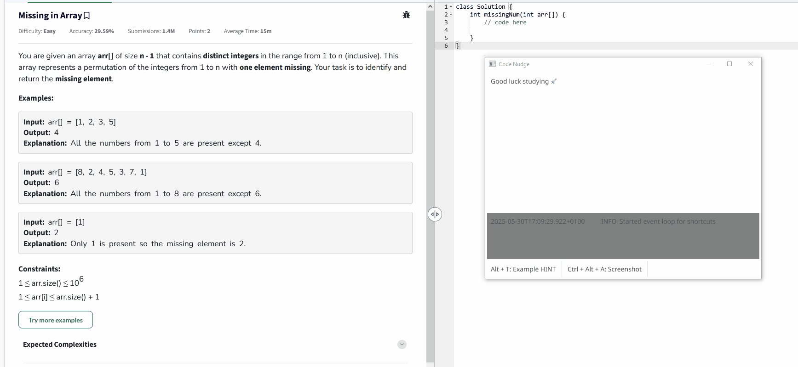
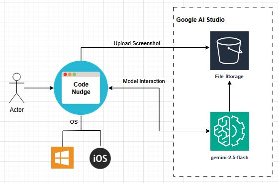

[](https://github.com/NCP-coding/Code-Nudge/actions/workflows/build-on-tag.yml)
# Code Nudge


Welcome to the **Code Nudge** project! This project showcases my development skills by building a simple, compiled desktop app that integrates AI. The focus is on clean encapsulation and separation of concerns, using a dependency injection framework ([uber-go/fx](https://uber-go.github.io/fx)).

## 🔍 Use Case

- Imagine you're preparing for interviews, solving coding problems.
- Sometimes, you just need a little hint — a *nudge* — to move forward.
- That’s where **Code Nudge** comes in: it helps you with 🔥 *small hints* 🔥 without spoiling the full solution.

---

## Table of Contents

- [Architecture](#architecture)
- [Development Workflow](#development-workflow)
- [Usage](#usage)
- [License](#license)
- [Contact](#contact)

## Architecture


The image above illustrates the general architecture. It's simple and straightforward: a single-window application built with [Fyne](https://fyne.io/) and a minimal Go client for Gemini ([Gemini API docs](https://ai.google.dev/gemini-api/docs)).

> **Note:**  
> This app is intended for single-user use. The `.env` file must contain a valid API key to run the app.

## Development Workflow
Pretty simple, due to the fact that golang is pretty selfcontained:

For starting the app run:
```
ps$ go run .\main.go
```

For compiling the executable:
```
ps$ go build -ldflags "-H=windowsgui" -o CodeNudge.exe
```

## Usage
1. Add your Google AI Studio API key to the .env file:
```
GENAI_API_KEY=XXXXXXXXXXXXXXXXXXXXXXXXX
```

2. Run the exe
```sh
ps$ .\CodeNudge.exe
```
3. Run `Ctrl + Alt + A: Screenshot` to take a screenshot and to get a hint.

## Environment Variable Reference

This document explains the purpose of each `.env` configuration used in the **Code Nudge** application.

### 🆔 `FYNE_APP_ID`
**Type:** `string`  
**Example:** `my.unique.app.id`  
A unique identifier for the desktop application. Used by the FYNE framework to register and manage the app instance.


### 🪟 `MAIN_WINDOW_TITLE`
**Type:** `string`  
**Example:** `Code Nudge`  
The title shown in the main window of the application.

### 🤖 `GENAI_API_KEY`
**Type:** `string`  
**Example:** `XXXXXXXXXXXXXXXXXXXXXXXXX`  
Your API key for accessing the Generative AI service. **Keep this secret and do not share or commit it.**

### 🧠 `GENAI_MODEL`
**Type:** `string`  
**Example:** `models/gemini-2.5-flash-preview-04-17`  
The identifier of the GenAI model to use. This could change depending on your provider’s available models or updates.

### 💡 `GENAI_MODEL_PROMPT`
**Type:** `string`  
**Example:**  
> Give me a small hint to help solve this coding problem without revealing the full solution. Focus on building my intuition and guiding me toward the right approach.  
Default prompt sent to the model to ensure consistent, helpful coding hints without revealing full solutions.

### 📸 `SCREENSHOT_DIR`
**Type:** `string (path)`  
**Example:** `./screenshots`  
Directory where screenshots will be saved. Relative to the app's working directory.

### 🖥️ `SCREENSHOT_CAPTURE_DISPLAY_INDEX`
**Type:** `integer`  
**Example:** `1`  
Specifies which display to capture (in multi-monitor setups). Index is typically `0`-based.

### 💾 `SCREENSHOT_SAVE_ENABLED`
**Type:** `boolean` (`true` or `false`)  
**Example:** `true`  
Enable or disable automatic saving of captured screenshots.


## License

This project is licensed under the MIT License. 

## Contact

For questions, please reach out.